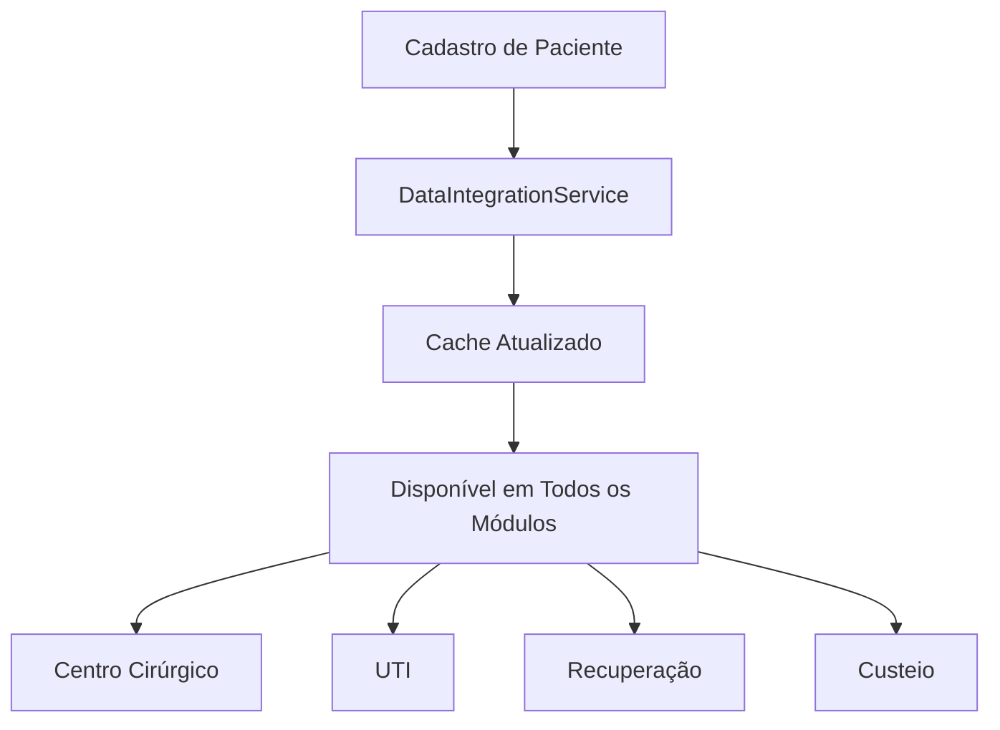

# Documentação de Integração de Dados - Sistema de Gestão Hospitalar

## Visão Geral

Esta documentação descreve a implementação de um sistema integrado de dados que permite o compartilhamento de informações entre todos os módulos da aplicação hospitalar. O sistema garante que um paciente cadastrado possa ser utilizado em todas as funcionalidades, mantendo a consistência e integridade dos dados.

## Arquitetura da Integração

### 1. Service Layer (DataIntegrationService)

**Localização:** `frontend/src/services/dataIntegration.ts`

O `DataIntegrationService` é o núcleo da integração, oferecendo:

- **Cache inteligente** com tempo de expiração de 5 minutos
- **Métodos centralizados** para acessar dados de pacientes, funcionários e internações
- **Validação de integridade** dos dados entre módulos
- **Sincronização automática** entre diferentes telas

#### Principais métodos:

```typescript
// Busca de pacientes
static async getPacientes(): Promise<Paciente[]>
static async getPacienteById(id: number): Promise<Paciente | null>
static async getPacienteByNumeroInternacao(numeroInternacao: string): Promise<Paciente | null>
static async searchPacientes(query: string): Promise<Paciente[]>

// Gestão de internações
static async getInternacoes(): Promise<Internacao[]>
static async getInternacoesAtivas(): Promise<Internacao[]>
static async getInternacaoByNumero(numeroInternacao: string): Promise<Internacao | null>

// Gestão de funcionários
static async getFuncionarios(): Promise<Funcionario[]>
static async getFuncionariosBySetor(setor: string): Promise<Funcionario[]>
static async getMedicos(): Promise<Funcionario[]>
static async getEnfermeiros(): Promise<Funcionario[]>

// Integração específica para módulos
static async getDataForCentroCircurgico(numeroInternacao: string)
static async getDataForUTI()

// Validação e sincronização
static async validateDataIntegrity(numeroInternacao: string)
static async syncPacienteData(pacienteId: number, updates: Partial<Paciente>)
```

### 2. Componentes Reutilizáveis

#### PacienteBuscador (`frontend/src/components/common/PacienteBuscador.tsx`)

Componente inteligente de busca de pacientes com:

- **Busca em tempo real** por nome, CPF ou número de internação
- **Filtros por status** (internado, centro cirúrgico, UTI, etc.)
- **Exibição de informações críticas** (alergias, tipo sanguíneo)
- **Validação automática** de dados de internação

**Uso:**
```typescript
<PacienteBuscador
  onPacienteSelecionado={handlePacienteSelecionado}
  filtrarPorStatus={['internado', 'centro_cirurgico']}
  showInternacaoInfo={true}
/>
```

#### FuncionarioSeletor (`frontend/src/components/common/FuncionarioSeletor.tsx`)

Componente para seleção de funcionários com:

- **Filtragem por setor e cargo**
- **Suporte a seleção múltipla**
- **Exibição de CRM/COREN** quando aplicável
- **Busca por nome ou registro profissional**

**Uso:**
```typescript
<FuncionarioSeletor
  onFuncionarioSelecionado={handleMedicoSelecionado}
  setor="Centro Cirúrgico"
  cargo="Médico"
  showCrmCoren={true}
/>
```

### 3. Estrutura de Dados Integrada

#### Modelo de Paciente Expandido

```typescript
interface Paciente {
  id: number;
  nome: string;
  cpf: string;
  dataNascimento: string;
  idade?: number;
  sexo: 'M' | 'F';
  endereco: Endereco;
  telefone: string;
  convenio: string;
  tipoSanguineo?: string;
  alergias?: {
    possui: boolean;
    descricao: string;
  };
  historicoMedico?: string;
  internacoes?: Internacao[];
  statusAtual?: 'ambulatorial' | 'internado' | 'centro_cirurgico' | 'uti' | 'recuperacao' | 'alta';
}
```

#### Modelo de Internação

```typescript
interface Internacao {
  id: number;
  pacienteId: number;
  numeroInternacao: string;
  dataInternacao: string;
  dataAlta?: string;
  motivoInternacao: string;
  medicoResponsavel: string;
  unidade: string;
  quarto?: string;
  leito?: string;
  status: 'ativa' | 'alta' | 'transferida' | 'obito';
  observacoes?: string;
  cirurgias?: CirurgiaRealizada[];
}
```

#### Modelo de Funcionário Expandido

```typescript
interface Funcionario {
  id: number;
  nome: string;
  cpf: string;
  cargo: string;
  setor: string;
  telefone: string;
  email: string;
  coren?: string;
  crm?: string;
  especialidade?: string;
  ativo: boolean;
  endereco?: Endereco;
}
```

### 4. Backend - Endpoints de Integração

#### Rotas de Pacientes Expandidas (`backend/src/routes/pacientes.js`)

```javascript
// Busca geral
GET /api/pacientes/search?q=termo

// Busca por internação
GET /api/pacientes/internacao/:numeroInternacao

// Internações ativas
GET /api/pacientes/internacoes/ativas

// Atualização de status
PATCH /api/pacientes/:id/status
```

#### Controller de Pacientes Expandido (`backend/src/controllers/pacientesController.js`)

Novos métodos implementados:

- `getPacienteByInternacao`: Busca paciente por número de internação
- `searchPacientes`: Busca por múltiplos critérios
- `getInternacoesAtivas`: Lista todas as internações ativas
- `updateStatusPaciente`: Atualiza status do paciente

## Fluxo de Integração

### 1. Cadastro Único de Paciente



### 2. Uso nos Módulos

#### Centro Cirúrgico
1. **Recepção**: Busca paciente → Carrega dados de internação → Valida integridade
2. **Assistência Intra-operatória**: Utiliza dados da recepção + equipe médica
3. **Recuperação**: Continua com dados do paciente + histórico cirúrgico

#### UTI
1. **Admissão**: Busca paciente por internação → Carrega histórico completo
2. **Monitorização**: Acesso a dados médicos + alergias + cirurgias anteriores

#### Custeio
1. **Vinculação**: Associa custos à internação específica
2. **Relatórios**: Dados integrados com paciente + cirurgia + materiais

### 3. Validação de Integridade

O sistema valida automaticamente:

- **Existência do paciente** na internação
- **Status da internação** (ativa/inativa)
- **Médico responsável** cadastrado no sistema
- **Consistência entre módulos**

```typescript
const validation = await DataIntegrationService.validateDataIntegrity(numeroInternacao);
if (!validation.isValid) {
  console.warn('Problemas encontrados:', validation.issues);
}
```

## Exemplo de Implementação

### Página com Integração (RecepcaoCentroCircurgico_Integrated.tsx)

```typescript
const handlePacienteSelecionado = async (paciente: Paciente) => {
  setPacienteSelecionado(paciente);
  
  // Buscar internação ativa automaticamente
  const internacaoAtiva = paciente.internacoes?.find(i => i.status === 'ativa');
  
  if (internacaoAtiva) {
    // Preencher formulário automaticamente
    setFormData(prev => ({
      ...prev,
      numeroInternacao: internacaoAtiva.numeroInternacao,
      nomePaciente: paciente.nome,
      dataNascimento: paciente.dataNascimento,
      sexo: paciente.sexo || 'M'
    }));

    // Validar integridade dos dados
    const validation = await DataIntegrationService.validateDataIntegrity(
      internacaoAtiva.numeroInternacao
    );
    setValidationErrors(validation.issues);
  }
};
```

## Benefícios da Integração

### 1. **Consistência de Dados**
- Cadastro único de paciente utilizado em todos os módulos
- Informações sempre sincronizadas
- Redução de erros de digitação

### 2. **Eficiência Operacional**
- Preenchimento automático de formulários
- Busca inteligente por múltiplos critérios
- Validação automática de dados

### 3. **Segurança**
- Alertas automáticos para alergias
- Validação de integridade entre módulos
- Rastreabilidade completa de ações

### 4. **Experiência do Usuário**
- Interface consistente entre módulos
- Componentes reutilizáveis
- Feedback visual de validação

### 5. **Manutenibilidade**
- Código centralizado no DataIntegrationService
- Componentes reutilizáveis
- Fácil adição de novos módulos

## Como Usar a Integração

### 1. Para Desenvolvedores

#### Adicionando um Novo Módulo

1. **Importe o serviço de integração:**
```typescript
import DataIntegrationService from '../services/dataIntegration';
```

2. **Use os componentes reutilizáveis:**
```typescript
import PacienteBuscador from '../components/common/PacienteBuscador';
import FuncionarioSeletor from '../components/common/FuncionarioSeletor';
```

3. **Implemente a busca de dados:**
```typescript
const handlePacienteSelecionado = async (paciente: Paciente) => {
  // Lógica específica do seu módulo
  const dadosEspecificos = await DataIntegrationService.getDataForSeuModulo(paciente.id);
};
```

### 2. Para Usuários Finais

#### Fluxo Típico de Uso

1. **Acesse qualquer módulo** (Centro Cirúrgico, UTI, etc.)
2. **Digite o nome do paciente** ou número de internação no campo de busca
3. **Selecione o paciente** da lista de resultados
4. **Verifique os alertas** de validação (se houver)
5. **Continue o atendimento** com dados já preenchidos

## Próximos Passos

### Melhorias Planejadas

1. **Cache Persistente**: Implementar cache no localStorage/sessionStorage
2. **Sincronização em Tempo Real**: WebSockets para atualizações automáticas
3. **Auditoria Completa**: Log de todas as ações de integração
4. **Dashboard de Integridade**: Painel para monitorar a qualidade dos dados
5. **API de Integração Externa**: Conectar com sistemas hospitalares externos

### Configurações Avançadas

```typescript
// Configuração do cache
DataIntegrationService.configure({
  cacheDuration: 10 * 60 * 1000, // 10 minutos
  enableValidation: true,
  logLevel: 'info'
});
```

## Suporte e Manutenção

Para dúvidas ou problemas relacionados à integração:

1. **Verifique os logs** do console do navegador
2. **Use o método de validação** para identificar problemas
3. **Limpe o cache** se necessário: `DataIntegrationService.clearCache()`
4. **Consulte esta documentação** para uso correto dos componentes

---

**Versão:** 1.0.0  
**Última atualização:** 10 de setembro de 2024  
**Autor:** Sistema de Gestão Hospitalar
